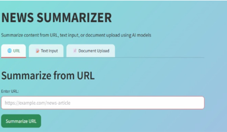
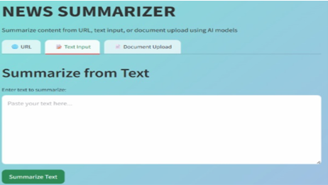
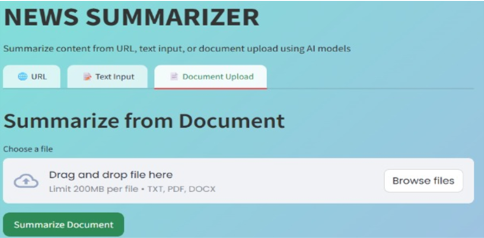

<div align="center">

# 📰 AI-Powered News Summarization Tool

### Intelligent Document & News Summarization using Transformer Models

[]()
[]()
[]()
[]()

</div>

---

## 📌 Overview

The AI-Powered News Summarization Tool is an NLP application that automatically generates concise and meaningful summaries from news articles, raw text, PDFs, and DOCX documents.

The application combines transformer-based models with OCR support to summarize both digital and scanned documents through a simple Streamlit interface.

---

## 🚀 Features

- 🌐 News summarization directly from URLs
- 📝 Summarization of raw text
- 📄 PDF summarization
- 📃 DOCX summarization
- 🔍 OCR support for scanned PDFs
- 🤖 Transformer-based summarization using **T5** and **BART**
- 🎨 Interactive Streamlit interface
- ⚡ Fast inference with Hugging Face Transformers

---

# 🏗️ System Architecture

```
                URL / Text / PDF / DOCX
                         │
                         ▼
                 Text Extraction Layer
        ┌──────────────┼───────────────┐
        │              │               │
 Newspaper3k      pdfplumber      OCR (Tesseract)
        │              │               │
        └──────────────┼───────────────┘
                       ▼
              Text Preprocessing
                       ▼
         Transformer Summarization
              ├──────────────┤
              │              │
             T5            BART
              │              │
              └──────────────┘
                     ▼
              Streamlit Interface
```

---

# 🛠 Tech Stack

| Category | Technologies |
|-----------|--------------|
| Language | Python |
| Frontend | Streamlit |
| NLP | Hugging Face Transformers |
| Models | T5, BART |
| OCR | Tesseract OCR |
| PDF Processing | pdfplumber, pdf2image |
| URL Extraction | Newspaper3k |

---

# 📂 Project Structure

```
News-Summarization-Tool
│
├── app.py
├── requirements.txt
├── README.md
├── screenshots/
├── sample_files/
└── .gitignore
```

---

# 📸 Application Screenshots

## 🌐 URL Summarization



---

## 📝 Text Summarization



---

## 📄 Document Summarization



---

# ⚙️ Installation

```bash
git clone https://github.com/Srithanachowdary/News-Summarization-Tool.git

cd News-Summarization-Tool

pip install -r requirements.txt
```

---

# ▶️ Run

```bash
streamlit run app.py
```

---

# 🔮 Future Enhancements

- Multi-language summarization
- Pegasus integration
- LongT5 support
- REST API deployment
- Voice summarization
- News sentiment analysis
- Cloud deployment

---

# 👩‍💻 Author

**Srithana Chowdary**

📧 srithanachowdary@gmail.com

🔗 LinkedIn: https://linkedin.com/in/m-srithana-chowdary

🔗 GitHub: https://github.com/Srithanachowdary
